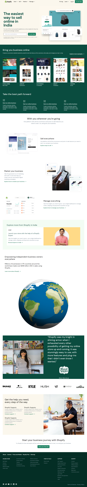

Hi This is Ravi K R, full stack web developer.

# Project Name : Shopify Clone [Tailwind CSS]

This is a Shopify Clone Website project which is built in Pure HTML and Tailwind CSS. Tailwindcss is a utility first CSS framework which make developer life easy while designing webpages and it makes much more easy to make your websites responsive. With that said, This Shopify Clone website is fully responsive with respect to add the screen sizes including Mobile, Tablet, Laptop and Desktop.
 
This framework helped me to build production ready code quikly for both desktop and mobile versions, and this project helped me to explore Tailwind Librarys, Utilitys and CSS class. 

 

## Tech Stack Used:

  

 

### Here's the Live Deployed Website:

[Live Link !](https://snazzy-dodol-f04582.netlify.app/)

#### This project took around 14 hours to complete.